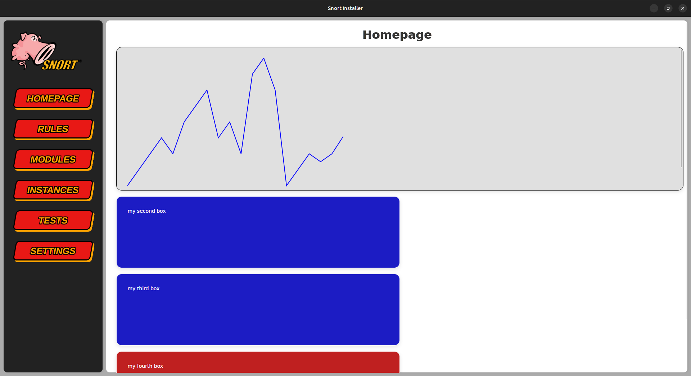

# [ITP] Install The Pork

This modern interface in Vuejs allows you to manage your snort installation. 

Features :
- Install, update and remove snort from one or several machine or with several instances in one machine.
- Statistics for an optimal snort usage
- PulledPork3 for rules management
- Rule editor and groups of rules
- Module store
- Stress test

And more to come...


## Sneak peak

### Menu


### Homepage


### Rules editor


### Modules store


## Tutorial

1- Install Tauri prerequisites :
https://tauri.app/start/prerequisites/

2- Download the git repo :
```bash
git clone https://github.com/Bl4omArchie/ITP.git
cd ITP
```

3- Install depedencies :
```bash
npm install
```

4- Launch the software : 
```bash
npm run tauri dev
```

## TODO

Front-end:
- create a rule editor with highlights, color syntax and more
- finish the module store
- make statistics graphic (network, number of machines...)
- and more...

Back-end:
- make bash scripts for snort management
- link the script with the Rust backend
- create a database for the store and other data
- use ssh connection for managing several machines
- and more...
