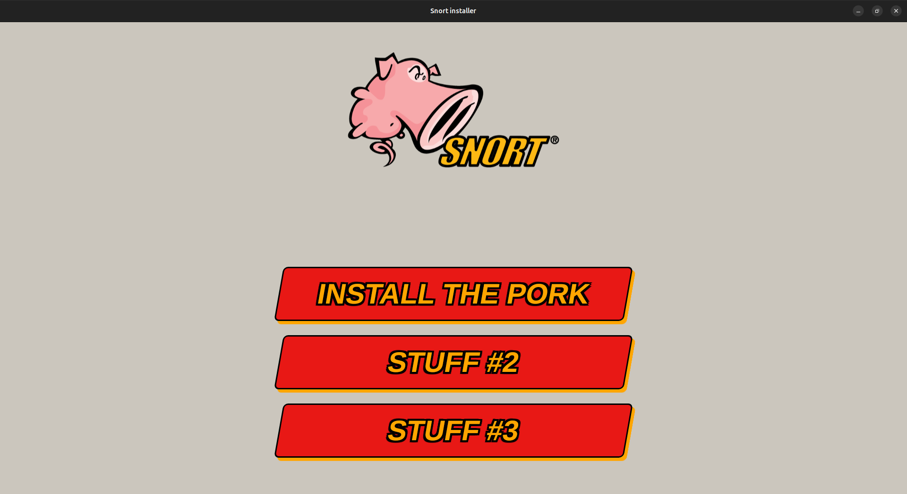
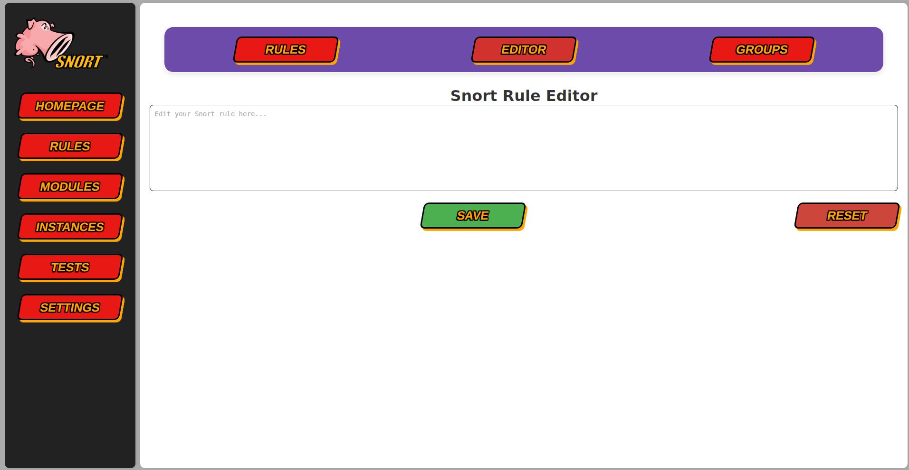
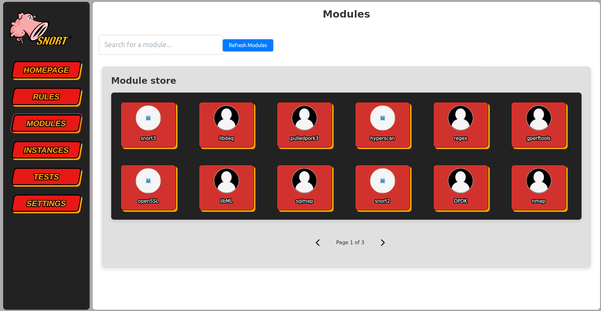

# [ITP] Install The Pork

This modern interface in Vuejs allows you to manage your snort installation. 
The v0 is a prototype so there is no actual features. I'm right now, developping ideas such rule editor with syntaxic highlight, automatic installation on one or several machines and more.


## Sneak peak

### Menu


### Rules editor


### Modules store



## Tutorial

1- Install Tauri prerequisites :
https://tauri.app/start/prerequisites/

2- Download the git repo :
```bash
git clone https://github.com/Bl4omArchie/ITP.git
cd ITP
```

3- Install depedencies :
```bash
npm install
```

4- Launch the software :
```bash
npm run tauri dev
```

## TODO

- Finish rule editor : issue with monaco
- Make the homepage where you can install snort automatically
- Make the rule manage with PulledPork3
- Find more community tools on Snort to integrate
